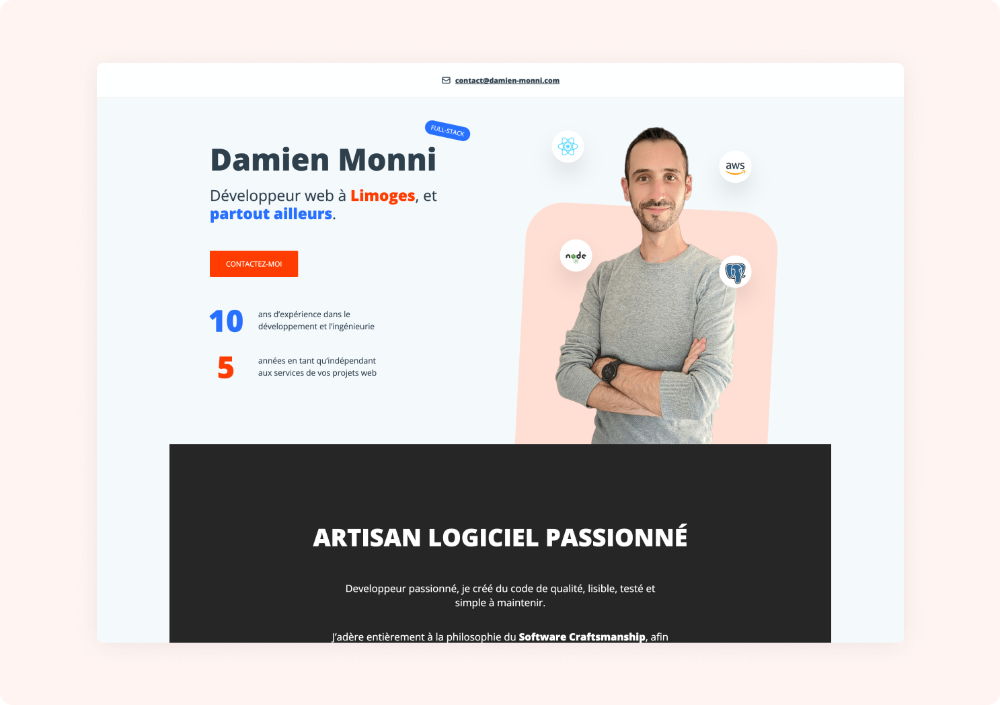

# Damien Monni - Javascript freelance full-stack web developer

This is my personal website as a javascript full-stack web developer.
This website is about the services I provide, the skills I have and my previous experiences.



It is a **React** and **Typescript** based website built with [Next.js](https://nextjs.org/), one of the most popular React Framework.

This website uses the following libraries:

- React
- Next.js
- Typescript
- TailwindCSS
- Storybook
- Jest
- Playwright

## Running locally in development mode

If you want to run this website locally in development mode:

1. Clone this repository to your local machine

`git clone https://github.com/damien-monni/damien-monni.git`

2. Install dependencies

```
cd damien-monni
npm install
```

3. Run the development server

`npm run dev`

You should be able to access the application locally at `http://localhost:3000`.

## File structure

Source code is located in the `./src` directory.

In this directory, you will find a `pages` directory containing the website pages entry points. A special `_app.tsx` file exports a React component to initialize every page of this website ([more on this here](https://nextjs.org/docs/advanced-features/custom-app)).

All React components are located in the `components` directory and groupped by feature.

## Design System

Theme is defined in tailwind.config.js.
Text color is defined in global.css and applied to the body element.

Design system component documentation can be viewed with Storybook `npm run storybook`

## Icons

We are using [heroicons](https://heroicons.com/) SVG icons with the [React library](https://github.com/tailwindlabs/heroicons#react) to get them as React Components.
Heroicon icons are made in two variants, solid or outline. We are using the outline variant.

## Class concatenation

We are using the `clsx` package to concatenate class names

## File structure

- Design system
- Components by feature
